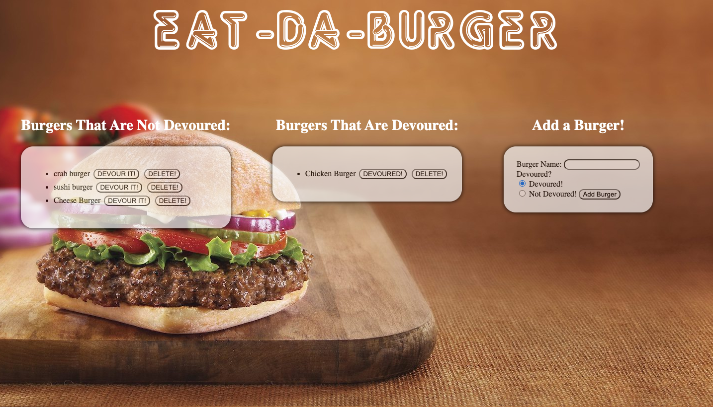

# burger

## Description 

 Eat-Da-Burger! is a restaurant app that lets users input the names of burgers they'd like to eat. Once added, you can select wether the burger has been devoured or not. The user is also able to delete a burger from the list. 
 This application was created using MySQL, Node, Express, Handlebars and a homemade ORM. 

## Table of Contents (Optional)

* [Installation](#installation)
* [Usage](#usage)
* [Credits](#credits)
* [License](#license)

## Installation

To install use the following command: 
<pre><code>npm i</pre></code>

## Usage 

Run: <pre><code>node server.js</pre></code> 

## License

## Contributing

Contributions in the form of issues and pull requests are welcomed and encouraged.

## Tests

To run tests use the following command:

<pre><code>npm run test</pre></code> 

